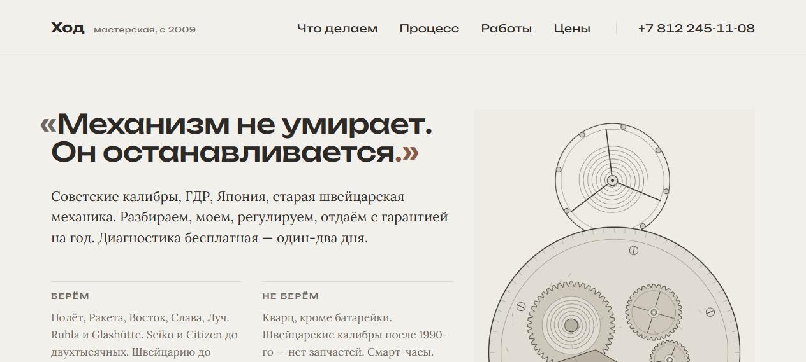

# Ход — мастерская реставрации часов

> Учебный веб-проект (pet-project) — демонстрация вёрстки и кода, **не коммерческий заказ**.

Сайт мастерской реставрации механических часов в Санкт-Петербурге: услуги, философия, галерея работ с реальными фото восстановленных часов.

## Демо
🔗 **[Открыть на GitHub Pages](https://Detroll1.github.io/hod-watches/)**



## Стек
HTML / CSS · галерея · адаптив

## Запуск локально
Статический сайт — просто открой `index.html` или подними локальный сервер:
```bash
python -m http.server 8124
# → http://127.0.0.1:8124
```

## Структура
Один входной `index.html`, стили и скрипты рядом. Данные и логика — в JS без завусеженности от бэкенда: сайт полностью работает из коробки.

---
© Detroll · hod-watches
